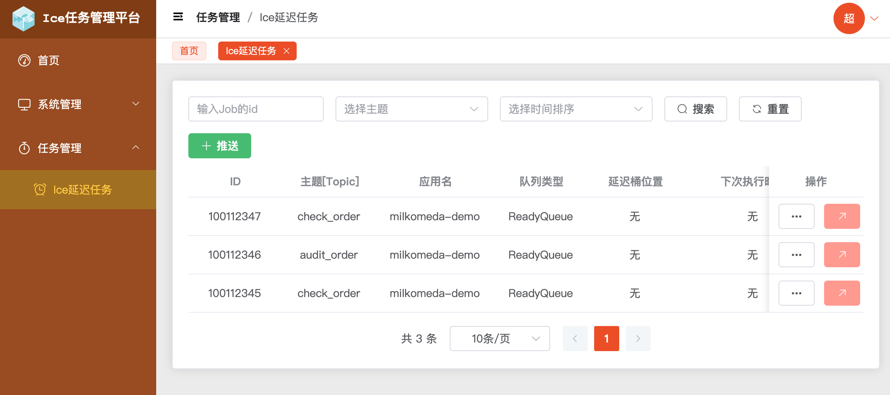

# 关于项目

该项目底层实现基于 [Milkomeda](https://github.com/yizzuide/Milkomeda) 的 <code>Ice</code> 模块实现，并提供了完整的 RBAC (Role-Based Access Control) 功能，可以根据业务需要进行扩展，但如果只是单独管理<code>Ice</code>的话是完全够用的。

# 技术栈

## 后端

采用前后端分离的开发方式，后端项目可前往 [ice-manage-server](https://github.com/yizzuide/ice-manage-server) 获取。

- SpringBoot 2.7.6
- Milkomeda 3.15.0
- Mybatis-plus 3.5.2

## 前端

- Typescript 4.8
- Vite 3.1
- Vue 3.2
- Vue-Router 4.1
- Pinia 2.0
- Axios 0.27
- Element-Plus 2.2
- Echarts 5.4
- Animate.css 4.1

# 页面预览图

## 首页数据面板

## 延迟任务列表管理

